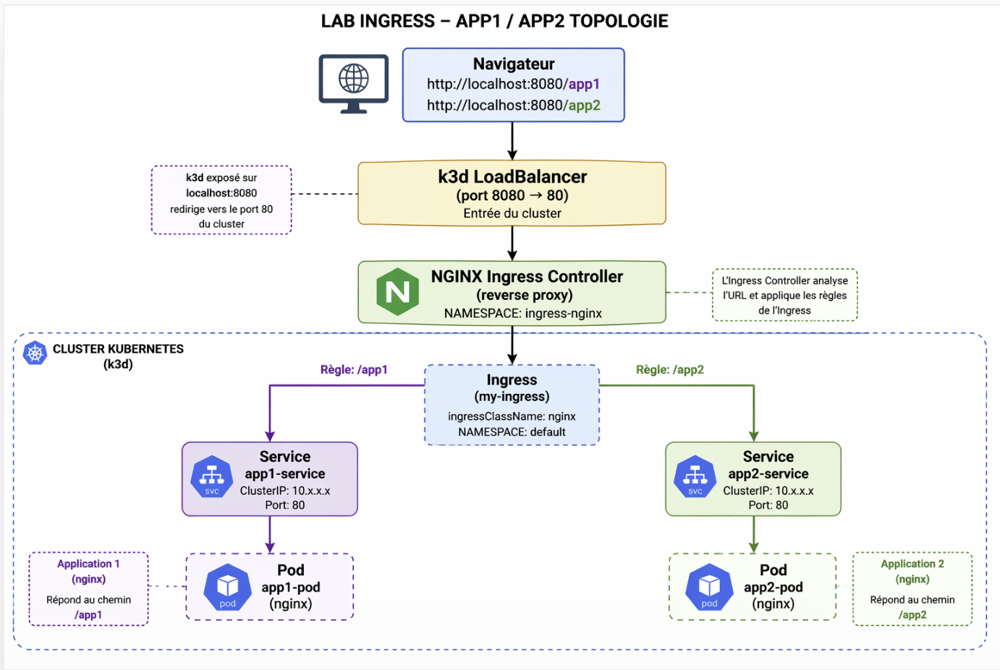

# 🚀 Kubernetes Ingress Lab (k3d)

## 📌 Overview

This lab demonstrates how to configure and troubleshoot an Ingress in Kubernetes using a local k3d cluster.

It focuses on real-world debugging scenarios encountered while working with Ingress, Services, and Pods.

---

## 🧱 Architecture

- Kubernetes (k3d / k3s)
- 
- Ingress Controller: Traefik (default in k3d)
- 
- Applications:
- 
  - app1 (nginx)
  - 
  - app2 (nginx)

### Routing

- /app1 → app1-service → app1 pod
- 
- /app2 → app2-service → app2 pod

---

## 🧭 Topology

Client → k3d LoadBalancer → Ingress Controller → Service → Pod

---

## ⚙️ Prerequisites

- Docker
- kubectl
- k3d

---

## 🚀 Step 1 - Create the cluster

k3d cluster create ingress-lab -p "8080:80@loadbalancer"

---

## 📦 Step 2 - Deploy applications

kubectl create deployment app1 --image=nginx

kubectl expose deployment app1 --port=80 --name=app1-service

kubectl create deployment app2 --image=nginx

kubectl expose deployment app2 --port=80 --name=app2-service

---

## 🌐 Step 3 - Create Ingress

kubectl apply -f ingress.yaml

---

## 🧪 Step 4 - Test

curl http://localhost:8080/app1

curl http://localhost:8080/app2

---

## ⚠️ Issues Encountered

- No resources found → wrong context
- 
- Endpoints none → no pods
- 
- 404 → wrong ingressClass or path issue

---

## 🔍 Debug Commands

kubectl get pods

kubectl get svc

kubectl get endpoints

kubectl get ingress

kubectl get all -A

---

## 🧹 Cleanup

k3d cluster delete ingress-lab

